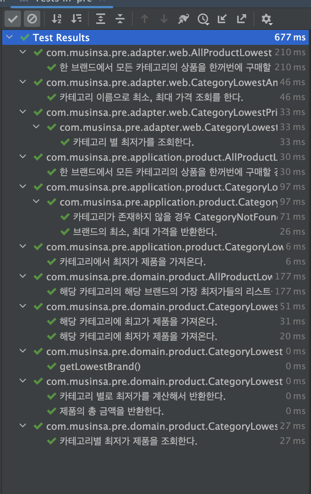

# 무신사 과제

# 모든 카테고리의 상품을 브랜드 별로 자유롭게 선택해서 모든 상품을 구매할 때 최저가 조회 API

`GET /v1/products/search/categories/lowest-price`

```json
{
  "header": {
    "isSuccessful": true
  },
  "result": {
    "content": {
      "products": [
        {
          "category": "스니커즈",
          "brand": "A",
          "price": "9000"
        },
        {
          "category": "가방",
          "brand": "A",
          "price": "2000"
        },
        {
          "category": "상의",
          "brand": "C",
          "price": "10000"
        },
        {
          "category": "바지",
          "brand": "D",
          "price": "3000"
        },
        {
          "category": "모자",
          "brand": "D",
          "price": "1500"
        },
        {
          "category": "아우터",
          "brand": "E",
          "price": "5000"
        },
        {
          "category": "액세서리",
          "brand": "F",
          "price": "1900"
        },
        {
          "category": "양말",
          "brand": "I",
          "price": "1700"
        }
      ],
      "price": "34100"
    }
  }
}
```

# 한 브랜드에서 모든 카테고리의 상품을 한꺼번에 구매할 경우 최저가 및 브랜드 조회 API
`GET /v1/products/all/categories/brands/lowest-price`

```json
{
  "header": {
    "isSuccessful": true
  },
  "result": {
    "content": {
      "brandName": "D",
      "price": "36100"
    }
  }
}
```

# 각 카테고리 이름으로 최소, 최대 가격 조회 API
`GET /v1/products/categories/상의/brands/lowest-highest-price

```json
{
  "header": {
    "isSuccessful": true
  },
  "result": {
    "content": {
      "highestPriceBrand": {
        "brandName": "I",
        "price": "11400"
      },
      "lowestPriceBrand": {
        "brandName": "C",
        "price": "10000"
      }
    }
  }
}
```

## 잘못된 입력 값 일 경우
`GET /v1/products/categories/이상한카테고리/brands/lowest-highest-price`

```json
{
  "header": {
    "resultMessage": "해당 카테고리가 존재하지 않습니다. : 이상한카테고리",
    "isSuccessful": false
  },
  "result": null
}
```


# 테스트 코드 결과



